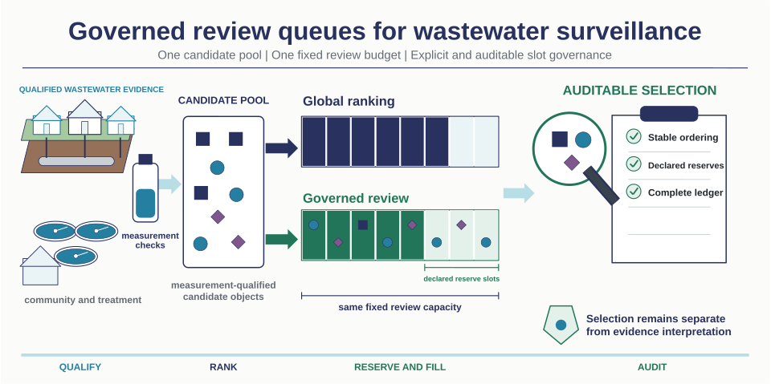

# Governed review queues for wastewater surveillance

Reference implementation for transparent, fixed-capacity evidence review in
multipathogen wastewater surveillance.



## What this repository provides

The package implements a small, auditable queue-selection core:

1. Determine one fixed review capacity.
2. Rank candidates with deterministic tie handling.
3. Allocate declared reserve slots to protected evidence domains.
4. Remove duplicates and fill all remaining slots from the global ranking.
5. Return a selection ledger showing how every slot was assigned.

Global and governed queues therefore operate on the same candidate pool and
the same total review capacity. Governance changes queue access, not the
strength or interpretation of the underlying evidence.

## Repository scope

This repository contains only the reusable queue mechanism, synthetic examples,
and tests. It intentionally excludes manuscript text, unpublished empirical
results, research datasets, trained models, submission figures, and internal
analysis records.

The software is a reference implementation for retrospective evaluation and
method development. It is not an outbreak-alert system, a clinical tool, or an
automated public-health decision system.

## Quick start

Python 3.10 or newer is required. The core package has no third-party runtime
dependencies.

```bash
python3 -m venv .venv
source .venv/bin/activate
python -m pip install -e .
python examples/run_example.py
```

Run the tests with:

```bash
python -m unittest discover -s tests -v
```

## Minimal API

```python
from governed_queues import ReservePolicy, select_governed_queue

result = select_governed_queue(
    candidates,
    burden=0.20,
    reserves=[
        ReservePolicy(
            name="protected_profile",
            eligibility_field="protected_profile",
            fraction=0.10,
            score_field="reserve_score",
        )
    ],
)

print(result.selected_ids)
print(result.as_dict())
```

Each candidate is a mapping with a unique `candidate_id`, a `global_score`, and
any fields referenced by reserve policies. See
[`examples/synthetic_candidates.csv`](examples/synthetic_candidates.csv) for a
complete synthetic input.

## Selection contract

- Capacity is fixed before any reserve is applied.
- Reserve fractions use explicit floor rounding.
- Reserves are applied in their declared order.
- A candidate can occupy at most one queue slot.
- Unused reserve capacity returns to the global fill.
- Equal scores are resolved by `candidate_id` for reproducibility.
- Missing or non-finite scores rank after finite scores.

## License and citation

Code is released under the [MIT License](LICENSE). Citation metadata are
provided in [`CITATION.cff`](CITATION.cff).

The overview figure is available as scalable vector artwork, a high-resolution
PNG, and a fully editable PowerPoint source in [`docs/source`](docs/source).
